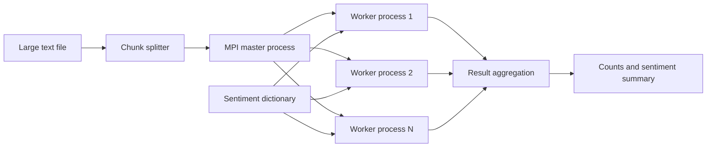

# Parallel File Processing and Sentiment Analysis

C++ MPI project for processing large text files in parallel and aggregating word, character, line, keyword, and sentiment results.

## Overview

This project uses MPI to distribute file-processing work across multiple processes. A large input file is split into chunks, processed by worker processes, and aggregated into final statistics. The implementation also includes sentiment keyword matching and fault-tolerant communication patterns.

## Tech Stack

- C++
- MPI
- File I/O
- Distributed processing
- Multithreading and synchronization concepts

## Processing Flow



## Key Features

- Splits large text files into processable chunks
- Counts lines, words, characters, and keyword frequencies
- Loads sentiment values from a dictionary file
- Aggregates partial results from worker processes
- Uses MPI message tags for work distribution, acknowledgement, reduction, and termination

## My Contribution

- Implemented MPI communication between producer/consumer processes
- Built chunk processing and aggregation logic
- Added sentiment dictionary loading and text normalization
- Included retry/timeout-style constants for more robust message handling

## What This Demonstrates

- Systems programming in C++
- Parallel processing
- Message passing with MPI
- Performance-oriented thinking
- Working with large text-processing workloads

## How To Run

```bash
mpic++ mpi_file_processor.cpp -o mpi_file_processor
mpirun -np 4 ./mpi_file_processor
```
